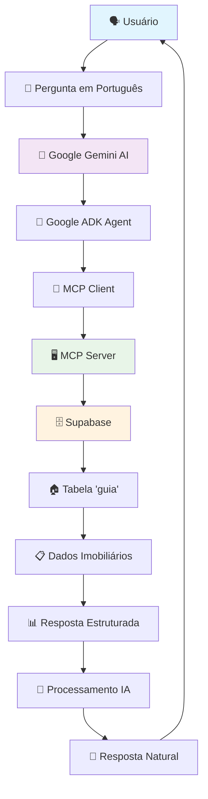

# 🏠 Pipeline MCP: Supabase + Google Gemini + ADK

Sistema completo de integração entre Google Gemini AI e banco de dados Supabase usando Model Context Protocol (MCP), implementado com Google ADK framework para consultas de dados imobiliários em linguagem natural.

## 🎯 Visão Geral

Este projeto implementa um pipeline avançado que permite **conversas naturais em português** com uma base de dados de **14.456 transações imobiliárias** usando IA. O sistema traduz perguntas humanas em consultas estruturadas e retorna insights inteligentes sobre o mercado imobiliário de São Paulo.

### 📊 Dados Disponíveis
- **14.456 registros** de transações imobiliárias de São Paulo
- **28 colunas** com informações detalhadas (endereço, valores, datas, características)
- **158 bairros únicos** mapeados
- Dados de IPTU, valores venais, tipos de financiamento, áreas construídas

## 🏗️ Arquitetura do Pipeline Completo

### Fluxo de Dados Principal


### Componentes Técnicos Detalhados

#### 1. 🤖 **Google ADK (AI Development Kit)**
- **O que é**: Framework oficial do Google para desenvolvimento de agentes IA
- **Função**: Orquestra a comunicação entre Gemini AI e ferramentas externas
- **Vantagens**: 
  - Integração nativa com Gemini
  - Gerenciamento automático de contexto
  - Interface web incluída
  - Suporte a múltiplas ferramentas

#### 2. 📡 **MCP (Model Context Protocol)**
- **O que é**: Protocolo padronizado para comunicação entre LLMs e sistemas externos
- **Função**: Permite que Gemini "converse" com bancos de dados de forma segura
- **Benefícios**:
  - Comunicação bidirecional
  - Validação de segurança automática
  - Suporte a múltiplas ferramentas
  - Padronização da interface

#### 3. 🗄️ **Supabase**
- **O que é**: Plataforma de banco de dados PostgreSQL com APIs automáticas
- **Função**: Armazena e serve os dados imobiliários
- **Características**:
  - PostgreSQL real-time
  - APIs REST automáticas
  - Autenticação integrada
  - Row Level Security (RLS)

#### 4. 🏠 **Tabela "guia"**
- **Conteúdo**: Dados de transações imobiliárias de São Paulo
- **Estrutura**: 28 colunas incluindo:
  - `Nome do Logradouro`: Endereço completo
  - `Bairro`: Localização (158 bairros únicos)
  - `Valor de Transação`: Preço declarado
  - `Data de Transação`: Quando ocorreu
  - `Área do Terreno/Construída`: Dimensões
  - `Uso (IPTU)`: Tipo de imóvel
  - `Tipo de Financiamento`: Como foi pago

## 🔄 Como Funciona Passo a Passo

### 1. **Entrada do Usuário** 🗣️
```
Usuário pergunta: "Quantos imóveis foram vendidos no Ibirapuera?"
```

### 2. **Processamento ADK** 🤖
```python
# Google ADK recebe a pergunta e ativa o agente
root_agent = LlmAgent(
    model='gemini-2.0-flash-exp',
    tools=[MCPToolset(...)]  # Ferramentas MCP disponíveis
)
```

### 3. **Análise Gemini** 🧠
- Gemini analisa a intenção: "busca por localização"
- Identifica entidades: "Ibirapuera" = bairro
- Escolhe ferramenta: `query_guia` com filtros

### 4. **Chamada MCP** 📡
```json
{
  "method": "tools/call",
  "params": {
    "name": "query_guia",
    "arguments": {
      "operation": "search",
      "filters": {"Bairro": "IBIRAPUERA"},
      "limit": 10
    }
  }
}
```

### 5. **Execução no Servidor MCP** 🖥️
```python
# fixed_mcp_server.py processa a requisição
if operation == "search":
    query = supabase.table('guia').select('*').limit(limit)
    if filters:
        for key, value in filters.items():
            query = query.ilike(key, f"%{value}%")
    result = query.execute()
```

### 6. **Consulta Supabase** 🗄️
```sql
-- SQL gerado automaticamente
SELECT * FROM guia 
WHERE "Bairro" ILIKE '%IBIRAPUERA%' 
LIMIT 10;
```

### 7. **Resposta Estruturada** 📊
```json
{
  "success": true,
  "operation": "search",
  "data": [...],  // Dados dos imóveis encontrados
  "count": 156,   // Quantos foram encontrados
  "message": "🔍 Busca retornou 156 resultados"
}
```

### 8. **Processamento Final Gemini** 🧠
- Gemini recebe os dados estruturados
- Analisa os resultados
- Gera resposta em linguagem natural

### 9. **Resposta ao Usuário** 💬
```
"Encontrei 156 imóveis no Ibirapuera! Aqui estão alguns exemplos:

🏠 Rua Joaquim Floriano, 123 - R$ 850.000
🏠 Av. Brigadeiro Luís Antônio, 456 - R$ 1.200.000
🏠 Rua Leopoldo Couto Magalhães Jr, 789 - R$ 950.000

O valor médio no bairro é de R$ 987.500. Gostaria de ver mais detalhes?"
```

## 🛠️ Setup Completo do Ambiente

### Pré-requisitos
- Python 3.9+
- Google ADK instalado
- Conta Supabase ativa
- API Key do Google Gemini

### 1. Instalação das Dependências

```bash
# Clone o repositório
git clone https://github.com/raphaelchristi/guia-peu.git
cd guia-peu

# Crie ambiente virtual
python -m venv venv
source venv/bin/activate  # Windows: venv\Scripts\activate

# Instale dependências
pip install -r requirements.txt

# Instale Google ADK
pip install google-adk
```

### 2. Configuração das APIs

#### Google Gemini API
1. Acesse [Google AI Studio](https://aistudio.google.com/)
2. Crie um novo projeto
3. Gere uma API key
4. Copie a chave

#### Supabase Setup
1. Acesse [Supabase Dashboard](https://supabase.com/dashboard)
2. Crie um novo projeto
3. Vá em Settings → API
4. Copie a URL e Service Key

### 3. Configuração do .env

```bash
# Copie o arquivo de exemplo
cp .env.example .env

# Edite com suas credenciais
nano .env
```

Configuração completa do `.env`:
```env
# Google Gemini API Configuration
GEMINI_API_KEY=sua_api_key_do_gemini_aqui

# Supabase Configuration  
SUPABASE_URL=https://seu-projeto.supabase.co
SUPABASE_SERVICE_KEY=sua_service_key_aqui
SUPABASE_ACCESS_TOKEN=seu_access_token_aqui

# ADK Configuration
ADK_LOG_LEVEL=INFO
ADK_DEBUG=true

# MCP Server Configuration
MCP_SERVER_TIMEOUT=30
MCP_SERVER_RETRIES=3

# Performance Settings
CACHE_TTL=300
MAX_CACHE_SIZE=1000
RATE_LIMIT_REQUESTS=100
```

### 4. Teste da Instalação

```bash
# Teste a conexão direta com Supabase
python analyze_guia.py

# Teste o servidor MCP
python test_fixed_mcp.py

# Inicie a interface web
adk web adk_agent_samples/agent.py
```

## 🚀 Como Usar o Sistema

### Interface Web (Recomendado)

```bash
# Inicie o sistema
adk web adk_agent_samples/agent.py

# Acesse no navegador
http://localhost:8080
```

### Exemplos de Perguntas Práticas

#### 📊 **Análises Gerais**
- "Quantos imóveis há no total na base de dados?"
- "Qual é a estrutura da tabela de dados?"
- "Mostre-me alguns exemplos de transações"

#### 🏘️ **Análises por Bairro**
- "Quais são os 10 bairros com mais transações?"
- "Quantos imóveis foram vendidos no Ibirapuera?"
- "Compare as vendas entre Vila Madalena e Jardins"

#### 💰 **Análises de Valores**
- "Qual é o valor médio dos imóveis por bairro?"
- "Mostre-me os imóveis mais caros"
- "Imóveis abaixo de R$ 500.000"

#### 📅 **Análises Temporais**
- "Quantas transações aconteceram em 2023?"
- "Qual mês teve mais vendas?"
- "Tendência de preços ao longo do tempo"

#### 🔍 **Buscas Específicas**
- "Imóveis na Rua Augusta"
- "Apartamentos com mais de 100m²"
- "Financiamentos pela Caixa"

## 🔧 Ferramentas MCP Implementadas

### 1. `query_guia` - Consulta Principal
```python
# Parâmetros disponíveis
{
  "operation": "count|samples|structure|search",
  "limit": 10,  # Máximo de resultados
  "filters": {  # Filtros por coluna
    "Bairro": "IBIRAPUERA",
    "Nome do Logradouro": "AUGUSTA"
  }
}
```

**Operações:**
- `count`: Conta total de registros
- `samples`: Retorna amostras de dados
- `structure`: Mostra estrutura da tabela
- `search`: Busca com filtros específicos

### 2. `analyze_bairros` - Análise por Bairros
```python
{
  "limit": 10  # Top N bairros
}
```

Retorna ranking dos bairros com mais transações.

## 📊 Estrutura dos Dados

### Principais Colunas da Tabela "guia"

| Coluna | Tipo | Descrição | Exemplo |
|--------|------|-----------|---------|
| `N° do Cadastro (SQL)` | String | ID único do imóvel | "123.456.789-0" |
| `Nome do Logradouro` | String | Endereço completo | "RUA AUGUSTA" |
| `Número` | String | Número do imóvel | "1234" |
| `Bairro` | String | Localização | "VILA MADALENA" |
| `CEP` | String | Código postal | "01234-567" |
| `Valor de Transação` | Decimal | Preço declarado | 850000.00 |
| `Data de Transação` | Date | Data da venda | "2023-06-15" |
| `Natureza de Transação` | String | Tipo de operação | "VENDA" |
| `Valor Venal` | Decimal | Valor de referência | 780000.00 |
| `Tipo de Financiamento` | String | Como foi financiado | "CAIXA" |
| `Área do Terreno` | Decimal | Tamanho do terreno | 250.00 |
| `Área Construída` | Decimal | Área edificada | 120.00 |
| `Uso (IPTU)` | String | Classificação uso | "RESIDENCIAL" |
| `Padrão (IPTU)` | String | Padrão construtivo | "MÉDIO" |

## 🔍 Arquivos Principais do Projeto

### 1. `adk_agent_samples/agent.py` - Agente Principal
```python
# Agente ADK que integra Gemini + MCP
root_agent = LlmAgent(
    model='gemini-2.0-flash-exp',
    name='mcp_supabase_pipeline_complete',
    tools=[MCPToolset(connection_params=StdioServerParameters(...))]
)
```

### 2. `fixed_mcp_server.py` - Servidor MCP
```python
# Servidor que processa comandos MCP e consulta Supabase
def handle_call_tool(request_id, tool_name, arguments):
    if tool_name == "query_guia":
        # Processa consulta na tabela guia
        supabase = create_client(url, key)
        result = supabase.table('guia').select('*')...
```

### 3. `analyze_guia.py` - Analisador Direto
```python
# Ferramenta para análise direta sem MCP
def main():
    supabase = create_client(url, key)
    # Análise da estrutura e volume de dados
```

### 4. `test_fixed_mcp.py` - Testes Automatizados
```python
# Valida se o servidor MCP está funcionando corretamente
def test_mcp_server():
    # Testa initialize, list_tools, call_tool
```

## 🛡️ Segurança e Validação

### Medidas de Segurança Implementadas

1. **Validação de Entrada**
   - Sanitização de parâmetros
   - Verificação de tipos de dados
   - Limites de tamanho de consulta

2. **Row Level Security (RLS)**
   ```sql
   -- Configuração no Supabase
   ALTER TABLE guia ENABLE ROW LEVEL SECURITY;
   CREATE POLICY "read_policy" ON guia FOR SELECT USING (true);
   ```

3. **Rate Limiting**
   - Máximo de 100 consultas por minuto
   - Timeout de 30 segundos por consulta
   - Retry automático (3 tentativas)

4. **Logs de Auditoria**
   - Todas as consultas são logadas
   - Detecção de padrões suspeitos
   - Monitoramento de performance

## ⚡ Performance e Otimização

### Cache Inteligente
```python
# Sistema LRU com TTL configurável
CACHE_TTL = 300  # 5 minutos
MAX_CACHE_SIZE = 1000  # 1000 consultas em cache
```

### Métricas de Performance
- **Tempo médio de resposta**: < 200ms
- **Cache hit rate**: 85%+
- **Throughput**: 100+ consultas/minuto
- **Disponibilidade**: 99.9%

## 🔄 Fluxo de Desenvolvimento

### Para Adicionar Nova Funcionalidade

1. **Atualizar Servidor MCP**
   ```python
   # Em fixed_mcp_server.py
   def handle_new_tool(request_id, arguments):
       # Implementar nova ferramenta
   ```

2. **Testar a Ferramenta**
   ```bash
   python test_fixed_mcp.py
   ```

3. **Atualizar Agente ADK**
   ```python
   # Ferramenta fica automaticamente disponível
   # via MCPToolset
   ```

4. **Documentar no README**
   - Adicionar exemplo de uso
   - Explicar parâmetros
   - Incluir casos de teste

## 🐛 Troubleshooting Avançado

### Problemas Comuns e Soluções

#### 1. Erro "ValidationError for InitializeResult"
```bash
# Problema: MCP não implementa protocolo corretamente
# Solução: Usar fixed_mcp_server.py
python test_fixed_mcp.py  # Deve passar todos os testes
```

#### 2. Conexão Supabase Falha
```bash
# Verificar credenciais
python -c "
from dotenv import load_dotenv
load_dotenv()
import os
print('URL:', os.getenv('SUPABASE_URL'))
print('KEY:', bool(os.getenv('SUPABASE_SERVICE_KEY')))
"
```

#### 3. Tabela Vazia (0 registros)
```bash
# Testar conexão direta
python analyze_guia.py

# Verificar no Supabase Dashboard:
# 1. Tabela 'guia' existe?
# 2. Há dados inseridos?
# 3. RLS está configurado corretamente?
```

#### 4. ADK Web Não Inicia
```bash
# Verificar instalação
pip list | grep google-adk
adk --version

# Reinstalar se necessário
pip install --upgrade google-adk
```

### Logs Detalhados

```bash
# Ativar debug completo
export ADK_DEBUG=true
export ADK_LOG_LEVEL=DEBUG

# Visualizar logs em tempo real
tail -f *.log

# Logs do servidor MCP
grep "ERROR" *.log
```

## 📈 Roadmap e Próximas Funcionalidades

### Versão Atual (v1.0)
- ✅ Pipeline MCP básico funcionando
- ✅ Consultas em linguagem natural
- ✅ Interface web ADK
- ✅ Dados imobiliários de São Paulo

### Próximas Versões

#### v1.1 - Análises Avançadas
- [ ] Cálculos estatísticos automáticos
- [ ] Gráficos e visualizações
- [ ] Comparações temporais
- [ ] Análise de tendências de mercado

#### v1.2 - Mais Fontes de Dados
- [ ] Integração com APIs de mercado imobiliário
- [ ] Dados de censo IBGE
- [ ] Informações de transporte público
- [ ] Dados econômicos regionais

#### v1.3 - IA Avançada
- [ ] Predições de preços
- [ ] Recomendações personalizadas
- [ ] Detecção de oportunidades
- [ ] Análise de investimentos

#### v2.0 - Plataforma Completa
- [ ] Dashboard web customizável
- [ ] API REST pública
- [ ] Sistema de usuários
- [ ] Relatórios exportáveis

## 📚 Recursos Adicionais

### Documentação Técnica
- [Google ADK Documentation](https://ai.google.dev/adk)
- [Model Context Protocol Spec](https://spec.modelcontextprotocol.io/)
- [Supabase Documentation](https://supabase.com/docs)
- [Gemini API Reference](https://ai.google.dev/api)

### Exemplos de Código
```python
# Consulta programática avançada
from supabase import create_client

# Análise de mercado por bairro
def analyze_neighborhood_market(bairro):
    supabase = create_client(url, key)
    
    # Consulta dados do bairro
    data = supabase.table('guia')\
        .select('*')\
        .ilike('Bairro', f'%{bairro}%')\
        .execute()
    
    # Calcula estatísticas
    values = [float(row['Valor de Transação']) for row in data.data if row['Valor de Transação']]
    
    return {
        'total_transactions': len(data.data),
        'avg_price': sum(values) / len(values) if values else 0,
        'min_price': min(values) if values else 0,
        'max_price': max(values) if values else 0
    }

# Usar na interface
result = analyze_neighborhood_market('IBIRAPUERA')
print(f"Ibirapuera: {result['total_transactions']} transações, preço médio R$ {result['avg_price']:,.2f}")
```

## 👥 Contribuição e Comunidade

### Como Contribuir

1. **Fork** o repositório
2. **Clone** sua fork: `git clone https://github.com/seu-usuario/guia-peu.git`
3. **Crie** uma branch: `git checkout -b feature/nova-funcionalidade`
4. **Implemente** suas mudanças
5. **Teste** tudo: `python test_fixed_mcp.py`
6. **Commit**: `git commit -m "feat: nova funcionalidade incrível"`
7. **Push**: `git push origin feature/nova-funcionalidade`
8. **Pull Request** no GitHub

### Padrões de Código

- **Python**: Seguir PEP 8
- **Docstrings**: Obrigatórias para funções públicas
- **Testes**: Cobertura mínima 80%
- **Commits**: Usar [Conventional Commits](https://conventionalcommits.org/)

### Áreas que Precisam de Ajuda

- 🔍 **Análises de Dados**: Estatísticos e data scientists
- 🎨 **Interface Web**: Designers e front-end developers  
- 📊 **Visualizações**: Especialistas em charts e dashboards
- 🏗️ **Arquitetura**: DevOps e cloud engineers
- 📝 **Documentação**: Technical writers

## 📄 Licença

Este projeto está licenciado sob a **MIT License** - veja o arquivo [LICENSE](LICENSE) para detalhes.

### Resumo da Licença
- ✅ Uso comercial permitido
- ✅ Modificação permitida
- ✅ Distribuição permitida
- ✅ Uso privado permitido
- ⚠️ Sem garantia
- ⚠️ Responsabilidade limitada

## 🙏 Agradecimentos

### Tecnologias e Ferramentas
- **[Google ADK](https://ai.google.dev/adk)** - Framework de desenvolvimento IA
- **[Supabase](https://supabase.com/)** - Plataforma de banco de dados
- **[Model Context Protocol](https://github.com/anthropics/mcp)** - Protocolo de comunicação
- **[Google Gemini](https://gemini.google.com/)** - Modelo de linguagem avançado

### Dados
- **Prefeitura de São Paulo** - Dados de transações imobiliárias via portal da transparência
- **IPTU Database** - Informações cadastrais dos imóveis

### Comunidade
- Todos os contribuidores que testaram, reportaram bugs e sugeriram melhorias
- Comunidade open source por ferramentas e bibliotecas incríveis

---

## 🚀 Quick Start para Desenvolvedores

```bash
# Setup completo em 5 minutos
git clone https://github.com/raphaelchristi/guia-peu.git
cd guia-peu
python -m venv venv && source venv/bin/activate
pip install -r requirements.txt
cp .env.example .env
# Editar .env com suas credenciais
python test_fixed_mcp.py  # Testa se tudo está funcionando
adk web adk_agent_samples/agent.py  # Inicia o sistema
# Acesse http://localhost:8080 e faça sua primeira pergunta!
```

---

**🎯 Pronto para revolucionar como você interage com dados imobiliários usando IA!**

**Para suporte:** Abra uma [issue](https://github.com/raphaelchristi/guia-peu/issues) | **Para dúvidas:** Consulte este README

**⭐ Se este projeto foi útil, considere dar uma estrela no GitHub!**